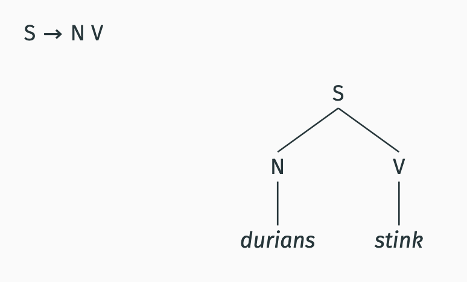
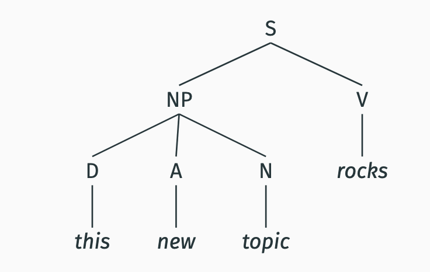
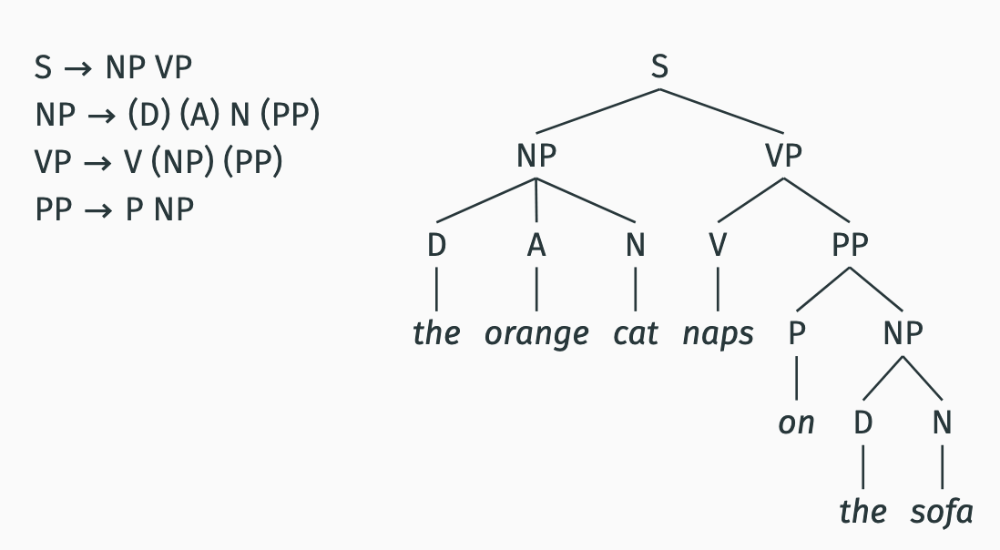

# Phrase-structure rules


## reminder

syntax has creativity, category dependance, recursion

# rule 1
Observation:
You can form a sentence in English by combining a noun
and a verb.

(1) 
a. Syntax rocks.

b. Durians stink.

c. Dorothy sleeps.

Phrase-structure rule:
S → N V
(“a sentence can consist of a noun and a verb”)



### Noun phrases
• The subject can be more complex than just a single word:
1. This topic rocks.
2. This new topic rocks.
3. Every cat in the room sleeps.

• The bolded words form a syntactic unit.

• We call this unit a Noun Phrase (NP)

S → NP V
(“a sentence can consist of a noun phrase and a verb”)

NP → (D) (A) N (P NP)
(“a noun phrase consists of a noun and optionally a
determiner, adjective, preposition and noun phrase”)

Elements in “( )” are optional



 ### Verb phrases 
 A subject NP can combine with more than just a verb:
(3) a. Syntax excites the students.
b. The cat likes Blanche.
• We call this unit a Verb Phrase (VP)


### PP
 In English, prepositions are usually followed by a NP:
(4) a. The students in the class rock.
b. Blanche walked into the porch.
• We call the unit that consists of the preposition and the NP
that follows it a Prepositional Phrase (PP)

Internal structure of PPs:
PP → P NP
(“a prepositional phrase consists of a preposition and an
NP”)

Placement of PPs:
NP → (D) (A) N (PP)
VP → V (NP) (PP)



## Auxiliaries
Sentences can contain more than one verb:
1. The cat can sleep.
2. Blanche is eating cheesecake.
3. Dorothy might sing.
These verbs are called auxiliary verbs (Aux):
can, be, have, do, should, will

 A new rule:
S → NP Aux VP

### Complementizer phrases

Subjects and objects do not have to be NPs, they can be
clauses too:
1. That Dorothy sings annoys Sophia.
2. I think that syntax rocks.

The bolded words form a unit.

 We call this unit a complementizer phrase (CP) because
they start with a complementizer.

Complementizers:
that, if, whether


some more rules 

These are the rules that we have so far (these are not yet final, though):
```
S → NP (Aux) VP
S → CP (Aux) VP
NP → (D) (A) N (PP) (CP)
VP → V (NP) (PP) (CP)
PP → P NP
CP → C S
```
