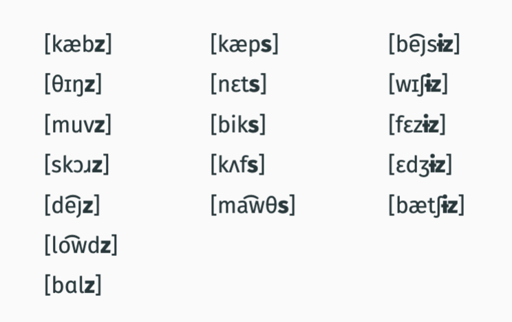
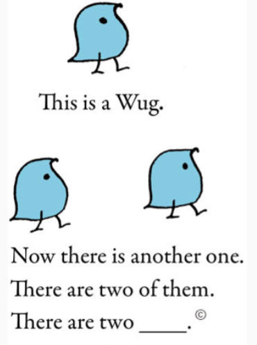
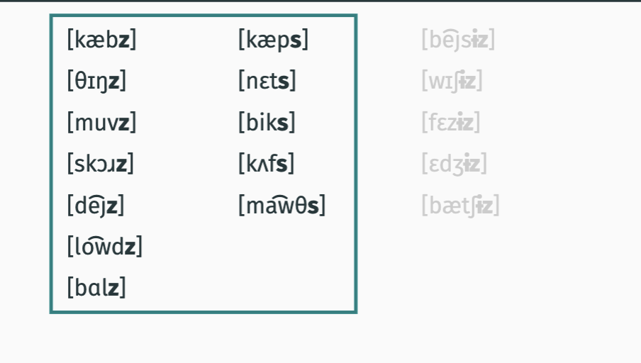
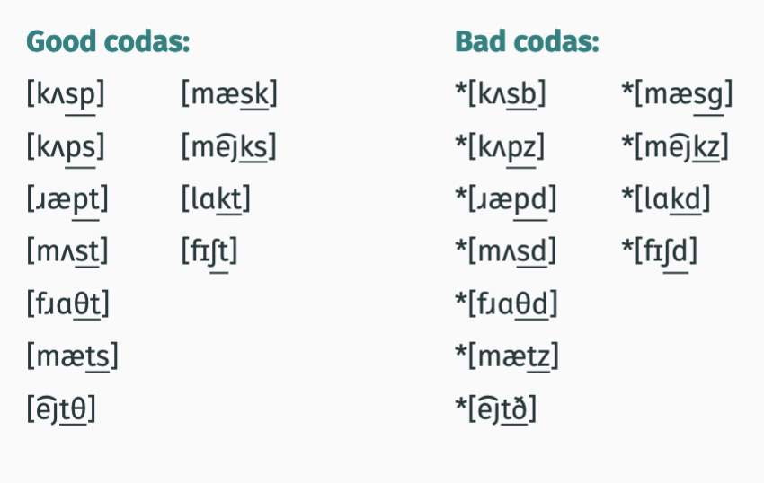
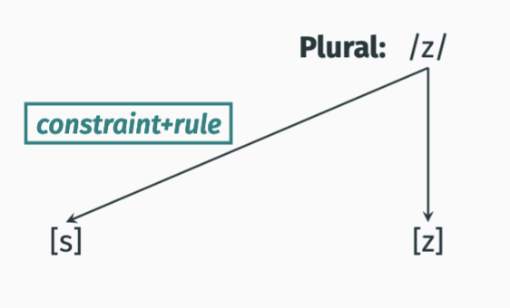
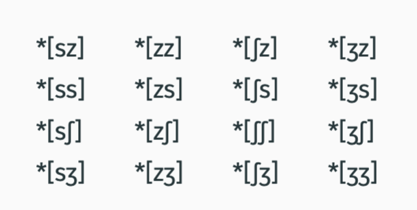
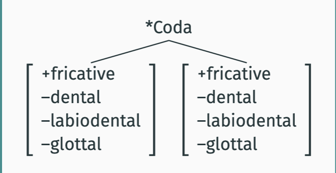
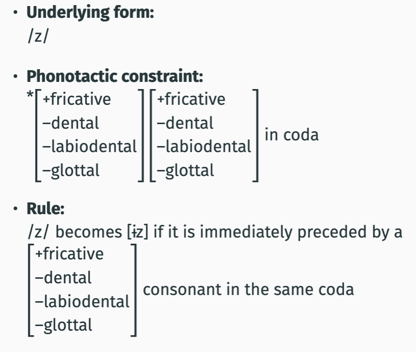
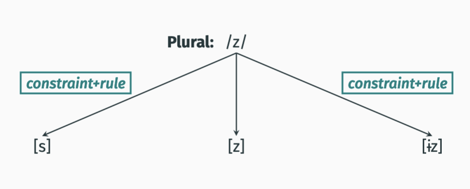

# plural
- [plural](#plural)
  - [refresher](#refresher)
    - [new type of rule](#new-type-of-rule)
  - [wug](#wug)
    - [examples](#examples)
  - [complemantary distribution](#complemantary-distribution)
  - [good and bad codas in english](#good-and-bad-codas-in-english)
  - [constraint on english codas](#constraint-on-english-codas)
    - [generalization](#generalization)
    - [underlying form](#underlying-form)
  - [notation](#notation)
    - [plural \[z\]](#plural-z)
    - [why not /s/?](#why-not-s)
      - [example](#example)
        - [advanced topic](#advanced-topic)
  - [\[i̵z\]](#i̵z)
    - [more impossible codas](#more-impossible-codas)
      - [second coda constraint](#second-coda-constraint)
  - [Where does \[i̵z\] occur?](#where-does-i̵z-occur)

## refresher
We have seen two interconnected parts of language:
1. a finite set of idiosyncratic, memorized basic elements
(words, sounds, ...)
1. rules manipulating these elements (syllabification)

Heuristic for analysis
- everythgin predictable is handled by a rule

### new type of rule
used when phototastic constraint is violated within a language.

these rules change the sound so that the result satesfies the constraint



## wug 


there are two wug[z] is the fill in 

### examples



voiced labial, Uvular are in col 1 with [z]

so 
- [z] is after vowel and voiced consonant

- [s] is after voiceless consonants

## complemantary distribution

meaning when two elements occur in *mutually exclusive enviroments*, they are in `complementary distribution`

- english plural
  -  [z] is after vowel and voiced consonant

  - [s] is after voiceless consonants

- occurs in precisely those enviroments where other never occurs
- basically its possible to *predict* from the preceding sound whether [z] or [s] will occur in a plural element 

the plural forms [z] and [s] are in complementary distribution


## good and bad codas in english




underlined are codas bc there is only one nucleus so anything after that is a coda


* means impossible in a language 


## constraint on english codas
constraint:
- a voiceless sound may not be immediately followed by a voiced sound within the same coda.

### generalization 
- [z]: after vowels and voiced consonants
- [s]: after voiceless consonants

___
-  The plural element has a single underlying form.
- This form sometimes gives rise to violations of a
phonotactic constraint.
- A rule is applied to change a sound so that the constraint is
no longer violated.


### underlying form

/z/ 

phonotactic constarint:
  - *[-voice][+voice] in coda

 rule: 
- /z/ becomes [s] if preceded by a [-voice] consonant in the same coda

constraint tells us what the problem is but not how to fix it. in order to know phonology of a language we need to know not only the constraints but the rules. 

so for /s ae p/ 

- s ae p z doesnt work
  - s ae p z e works 
  - s ae p s works 
  - s ae p e z works 
  - s ae b z? 
  

## notation 
-  By assumption, the underlying form is what a speaker has
memorized, and in some cases this form is changed by a
phonological rule.

- It is useful to have a way of distinguishing between a word’s
representation in the speaker’s memory and how it is
actually pronounced.
-  Actual spoken sounds are enclosed between square
brackets: “[ ]”
-  Underlying forms are represented between slashes: “/ /”
  

### plural [z]

  /z/ -> [z]




### why not /s/?
q: why /z/ as underying form and not /s/ where it changes to /z/?

a: no, we assume that rules that change sounds apply only if a phonotactic constraint would be violated otherwise. the plural element is [z] in many chases in which [s] would not violate a photactic cosntraint

#### example

‘boys:’ [b ͡ɔȷz] *[b ͡ɔȷs] | ***but***: [v ͡ɔȷs] ‘voice’

‘scores:’ [skɔɹz] *[skɔɹs] |  ***but***: [hɔɹs] ‘horse’

‘dens:’ [dɛnz] *[dɛns] | ***but***: [dɛns] ‘dense’

‘falls:’ [fɑlz] *[fɑls] | ***but***: [fɑls] ‘false’

**conclusion**

the codas [s], [ɹs], [ns], and [ls] don't violate any phonotactic constraints of English.

if the underlying form of the plural were /s/ we would incorrectly predict the plural forms are *[b ͡ɔȷs], *[skɔɹs], *[dɛns], *[fɑls]

tldr: the reason we talk about this is because /z/ is stored in our mental dict, which is sorta strange bc its written with /s/ but that doesnt work 

if it was underlined with s we would need a constraint/rule that explains why it shows up as z.

this would work fine for cabs (violates constraint), but not scores. 


Ann's - [aenz]

Ralph's r ae l f s

Noah's n ow a z 


##### advanced topic
z and other voiced fricatives, they become voiceless if you say them long enoguh as its hard to sustrain the voiced. 


## [i̵z]

alveolar and post alveolar fricatives
[i̵z] is after [s], [z],[ʃ], and [ʒ]

[z] + [s]:
only after sounds other than [s], [z], [ʃ], and [ʒ]


complementary distribution and predictable!


### more impossible codas



[IPA Consonants Chart](./lecture%20notes/1%20anatomy%20of%20the%20vocal%20tract%20and%20IPA/ipaChartConsonants.png)


s z ʃ ʒ h 

so alveolar + post alveolar pricatives 
```
+fricative
−dental
−labiodental
−glottal
```


> labial is anyhting in bilabial or labiodental


side note:
[-glottal] isn't necessary becuase [h] never occurs in coda in English, so we don't have to wrry about it. We kept it in for clarify tho

so 


#### second coda constraint 
Constraint:
A non-dental, non-labiodental, and non-glottal fricative may
not be immediately followed by another non-dental,
non-labiodental, non-glottal fricative within the same coda




*tz -> ts can do

*sʃ *sʒ -> can't do the same 

why? 
bc if we try to change the voiceing we get a different illegal coda 
*ss 

can do, make separate syllibles

sʒ can do tasiʒ (add syllyible, or delete parts)

## Where does [i̵z] occur?

[i̵z]:
after [s], [z], [ʃ], and [ʒ]

[z] + [s]:
only after sounds other than [s], [z], [ʃ], and [ʒ]


<details open>
<summary>The general picture (rept.)</summary>

- The plural element has a single underlying form.

- This form sometimes gives rise to violations of a
phonotactic constraint.
- A rule is applied to change a sound so that the constraint is
no longer violated.
</details>







next class, other types of plurals