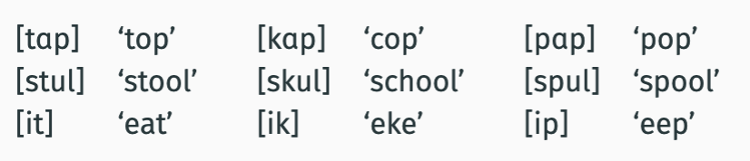
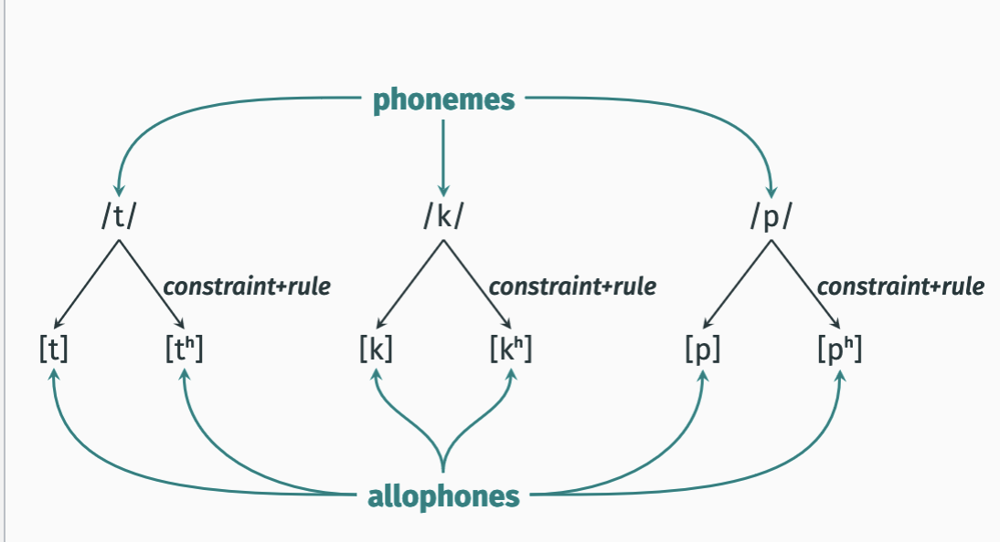
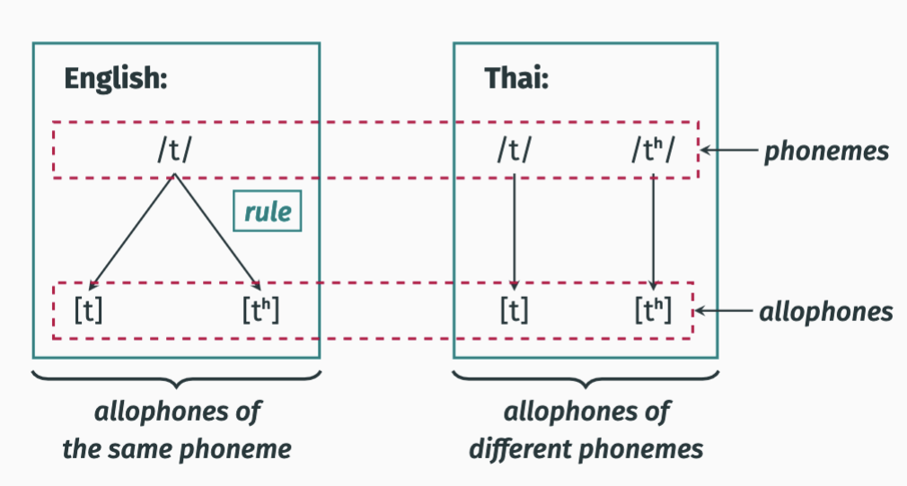

# Phonemes and allophones
- [Phonemes and allophones](#phonemes-and-allophones)
- [plural review](#plural-review)
  - [Key idea](#key-idea)
  - [what we analysed](#what-we-analysed)
  - [new observations](#new-observations)
- [English aspiration](#english-aspiration)
      - [Generalized statement:](#generalized-statement)
    - [/ vs \[](#-vs-)
  - [Phonotactic constraints](#phonotactic-constraints)
  - [principle of simplicity](#principle-of-simplicity)
  - [remaining complication](#remaining-complication)
- [articulatory features](#articulatory-features)
  - [terminology: phonemes and allophones](#terminology-phonemes-and-allophones)
  - [Aspiration analysis vs plural analysis](#aspiration-analysis-vs-plural-analysis)
  - [Allophones of different phonemes](#allophones-of-different-phonemes)
  - [Allophones of different Phonemes](#allophones-of-different-phonemes-1)
  - [minimal pair](#minimal-pair)
    - [exmaple](#exmaple)

# plural review
fill in after class

## Key idea
The form of the plural in English varies, but is predictable.


## what we analysed 
- **one underlying form**
- This form sometimes gives rise to violations of a
phonotactic constraint.

- A rule is applied to change the sound so that the constraint
is no longer violated.

## new observations

Sometimes the distruibution of specific sounds in a language is entirely predictable

- given two sounds a and b we can predict which would show up

this means: The two sounds are in complementary distribution
throughout the entire language.

review - 
We will capture this observation in the same way that we did
for the English plural:
• One of the sounds is underlying (say, A).
• In some environments, this sounds violates a phonotactic
constraint.
• A rule applies that changes A to B in these environments


# English aspiration


[tʰɑp] ‘top’ [kʰɑp] ‘cop’ [pʰɑp] ‘pop’

English speakers know where aspiration goes in words, even if they havent heard them before

'torble' 'stib' 'ort'
we know torble is aspirated while others arent. shows that it follows a rule.

#### Generalized statement:
tʰ
kʰ
pʰ

occur in first sound of syllable

t and tʰ are in complementary distribution

k and kʰ are 

p and pʰ as well

```
*onset - #[-aspirated -voice +stop] -> "beginning of word"
          (spells out the following,t,p,k)

```

### / vs [
Underlying form

- / is phonemic (abstract underlying sounds and shows how words are stored in mind. top and stop are written the same although top is asperated)

Surface form
- [ is phnetic (spoken sounds and more defail on how sounds are profuced)
___
- "top" /tаp/ -> [tʰаp]
- 'pop'  pаp/ -> [pʰаp]
- "cop"/kаp/ -> [kʰаp]

## Phonotactic constraints
1. [t] cannot be the first sound of an onset
2. [p] cannot be the first sound of an onset 
3. [k] cannot be the first sound of an onset
   (unaspirated t,p,k)

^These are three separate constraints but they clearly look
very similar to each other. We will combine them into a
single constraint later on.

## principle of simplicity 
if somethign follows a gnerarl rule speakers dont memorize it 

so since the rule dictates what is aspirated, speakers dont memorize 

only unaspirated sounds are ever memorized

## remaining complication
Constraints on English onsets:
1. [t] cannot be the first sound of an onset.
2. [p] cannot be the first sound of an onset.
3. [k] cannot be the first sound of an onset.

Rules:
1. Change /t/ to [tʰ] when it is the first sound of an onset.
2. Change /p/ to [pʰ] when it is the first sound of an onset.
3. Change /k/ to [kʰ] when it is the first sound of an onset.

# articulatory features
we by collapsing the three rules, can make one singple rule by using articulatory features 
- Feature-based constraint formulation:
[–voice, –glottal, +stop, –aspirated] cannot be the first sound of an onset.

-  Feature-based rule formulation:
Change /–voice, –glottal, +stop, –aspirated/ to [+aspirated] if it is the first sound in a syllable.

## terminology: phonemes and allophones
term: `phoneme`
- a sound (phone) as it is stored in memory (/ /)
  
term: `allophone`
- a sound (phone) as it is pronuounced ([ ])

[x] is an allophone of a phoneme /y/ if [X] is one way that speakers pronounce /y/

[t] and [tʰ] are allophones of the phoneme /t/ in English



## Aspiration analysis vs plural analysis 
  two central differences between our analysis of enlgish aspiration and our analysis of English plurals
- with aspiration, the phonotactic conflict doesnt arise from combining elements
  - rather its the underlying form of a word that violates a constraint
  
- so we are making claims about all words of a language


## Allophones of different phonemes 
Phonotactic constraints differ from language to language

Prediction:
If rules are triggered by phonotactic constraints, then rules should differ between languages too.

## Allophones of different Phonemes
In English, [t] and [tʰ] are allophones of the same phoneme:
- There is a rule between the two → predictable
  
In Thai and Hindi-Urdu, [t] and [tʰ] are allophones of
different phonemes.
-  There is no rule → not predictable
-  
In Thai (Kra-Dai), the following are distinct words:
(1) a. [tam] ‘to pound’
b. [tʰam] ‘to do’


## minimal pair
term: `minimal pair` is a pair of words that differ in just one sound.

often used to show that two sounds are distinct phonemes in a language

bat and pat  (/b/ vs. /p/)

a minimal pair for [X] and [Y] is a minimal pair where one
word contains [X] and the other contains [Y].

a. [miɹ] vs. [niɹ] minimal pair for [m] and [n]

b. [sɪp] vs. [ʃɪp] minimal pair for [s] and [ʃ]

c. [s ͡eȷf] vs. [s ͡eȷv] minimal pair for [f] and [v]

d. [bIt] vs [bet]  

e. pray: [preɪ] vs [spreɪ]


If a lanauge contains a minimal pair for [x] and [y] then: 
its not possible to predict if [x] or [y] will occur based on the env

[x] and [y] are allephones of different phonemes

[x] and [y] are not in complementary distribution

### exmaple 
Minimal pairs:
[l ͡ owð] vs. [l ͡ owd] [ð ͡aȷ] vs. [d ͡aȷ]

Occurrence of [d] vs. [ð] is not predictable.
[d] and [ð] are allophones of different phonemes in English.
