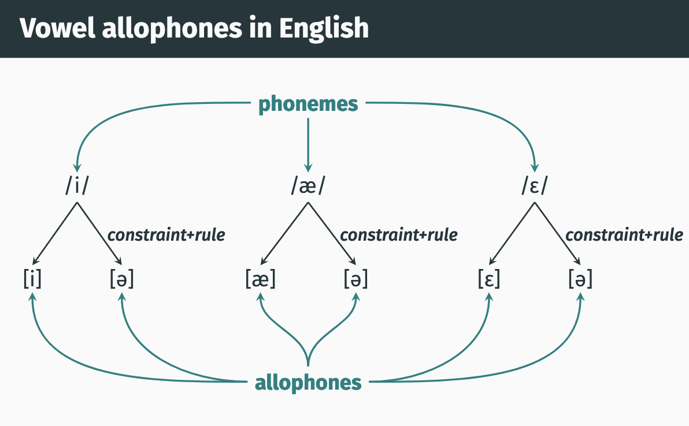

# Stress and Flapping

- [Stress and Flapping](#stress-and-flapping)
- [Stress](#stress)
  - [primary and secondary stress](#primary-and-secondary-stress)
    - [examples](#examples)
  - [Stress-conditioned allophony](#stress-conditioned-allophony)
  - [Vowel reduction](#vowel-reduction)
      - [Vowel reduction examples](#vowel-reduction-examples)
    - [rule](#rule)
- [Flapping](#flapping)
  - [t/d allophones](#td-allophones)

some phonological properties pertain to syllables rather than segmentals (ie sounds)

such properties are called `suprasegmentals`

tone and setress are two suprasegmental properties

# Stress

some syllables are more prominant than others, those syllables are stressed

indicated in ipa with ['] at the beginning of a syllable

[bə.næ.nə] ‘banana’ → [bə.ˈnæ.nə]
[kæ.nə.də] ‘Canada’ → [ˈkæ.nə.də]

can test for stressed syllable by just clapping one and seeing where it falls ( i feel like clapping for all syllables and seeing which one is instinctively louder is better tho?)

## primary and secondary stress

longer words have more than oen stressed syllable

typically each owrd has one syllable with primary stress ['] and may have other syllables with secondary stress [,]

### examples 

- [mɪ.nə.s͡ow.tə] → [ˌmɪ.nə.ˈs͡ow.tə]
- [mæ.sə.tʃu.sɪts] → [ˌmæ.sə.ˈtʃu.sɪts]
- [θəɹ.mɑ.mɪ.ɾi̵ɹ] → [θəɹ.ˈmɑ.mɪ.ɾi̵ɹ]͡

##  Stress-conditioned allophony

-freaking- infixation:
[kæ.lɪ.ˈfɔɹ.njə] ‘California’
a. Cali-freaking-fornia

b. *Ca-freaking-lifornia

in some cases, allophony is dependent on stress too.

## Vowel reduction

[ˈtɛ.lə.ˌɡɹæf] ‘telegraph’

[tə.ˈlɛ.ɡɹə.ˌfi] ‘telegraphy’

[ˌtɛ.lə.ˈɡɹæ.fɪk] ‘telegraphic’̵

• Vowels in unstressed syllables are often realized as schwa
([ə]), or [i̵].

#### Vowel reduction examples
- [ˈæ.si̵d] [ə.ˈsɪd.i̵k]
- [ˈhi.ˌɹo͡w] [hə.ˈɹo͡w.i̵k]
- [ˈfo͡w.ɾə.ˌgɹæf] [fə.ˈtʰɑ.gɹə.fi]
- [ˈsɪ.vəl] [sə.ˈvɪ.li.ən]
- [ˈfa͡j.nəl] [fə.ˈnæ.lə.ɾi]
- [ˈple͡j.ˌɾo͡w] [plə.ˈtʰa.ni̵k]
- [ˈtʰɛ.lə.ˌgɹæf] [tʰə.ˈlɛ.gɹə.fi]
- [ˈsʌb.ˌdʒɛkt] [səb.ˈdʒɛk.ti̵v]
- [ˈpɑ.lə.ti̵ks] [pə.ˈlɪ.ɾi̵.kəl]

### rule

want to change any vowel toa schwa [ə] in an unstresed syllable

in features /+ vowel - stress/ -> / -low
-high
-back
-front/ (can write + central but later on in ling we will find that central isn't really a used feature, if we just open mouth an make a noise it will likely be a schwa)

# Flapping

• In some cases, [d] or [t] will become a [ɾ] in casual speech:

[sɪt] ‘sit’ [sɪɾi̵ɹ] ‘sitter’

[spɑt] ‘spot’ [spɑɾi] ‘spotty’

[mæd] ‘mad’ [mæɾi̵ɹ] ‘madder’

[dɑɹk] ‘dark’ [tʰæp] ‘tap’

First stab:
[t] and [d] are changed to [ɾ] between vowels.

Flapping in English:

Change [d] and [t] to [ɾ] if it is preceded and followed by a
vowel *AND* the [d] or [t] occurs in an unstressed syllable

In Features:
Change [alveolar, plosive] to [voiced, flap] if it is preceded
and followed by a vowel AND the [alveolar, plosive] occurs
in an unstressed syllable.

## t/d allophones

