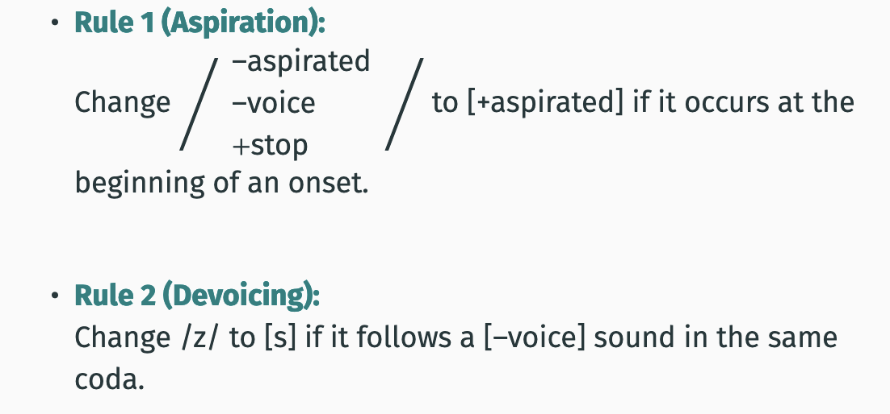
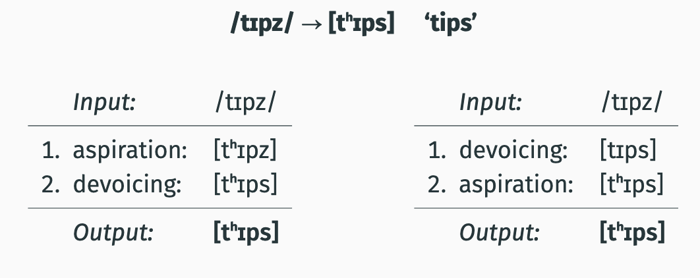
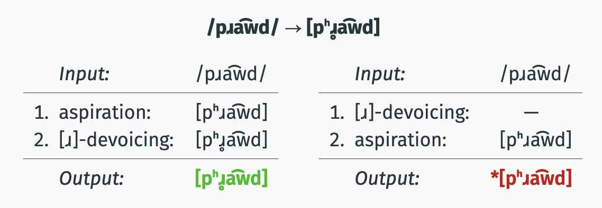

# Feeding, bleeding, and rule interactions
- [Feeding, bleeding, and rule interactions](#feeding-bleeding-and-rule-interactions)
  - [review](#review)
- [rule interaction](#rule-interaction)
    - [unrelated rules example](#unrelated-rules-example)
    - [example English \[ɹ̥\]](#example-english-ɹ̥)
      - [Formal Notation](#formal-notation)
    - [two orders](#two-orders)
  - [feeding](#feeding)
  - [bleeding](#bleeding)
    - [example canaian engllish](#example-canaian-engllish)
      - [Flapping rule:](#flapping-rule)
      - [rasiing:](#rasiing)
      - [rule ordering](#rule-ordering)
  - [summary](#summary)

## review
- In some cases, the underlying form of a word violates a
phonotactic constraint.
- In these cases, a rule is applied that changes the offending
sound.
- The resulting representation no longer violates the
phonotactic constraint.

# rule interaction
- In some cases, more than one rule applies to a word.

### unrelated rules example

The rules produce the correct result regardless of the order
that they apply in. They do not interact with each other.

in other cases rules apply in a specific order

### example English [ɹ̥]

Generalization:
[ɹ̥] occurs after aspirated sounds;
[ɹ] occurs anywhere else

Underlying form:
/ɹ/

Phonotactic constraint:
*[aspirated][ɹ]

Rule:
Change /ɹ/ to [ɹ̥] if it follows an aspirated sound.

#### Formal Notation
/ɹ/ -> [-voice] / [+aspirated]__

### two orders

Only Only the order “Aspiration → [ɹ]-devoicing” produces the right result. It can't happen in the other order, since [ɹ]-devoicing has nothing to go off of. 

## feeding

- Aspiration creates the environment for [ɹ]-devoicing.
- This interaction between rules is called feeding.
- Aspiration feeds [ɹ]-devoicing.
  
Terminology `Feeding`:
Rule A feeds Rule B when A creates a context for B, and B
would not apply otherwise.

## bleeding

### example canaian engllish 
#### Flapping rule:
Change [d] and [t] to [ɾ] if preceded and followed by a vowel
and the [d] or [t] occurs in an unstressed syllable.

In features:
Change [alveolar, stop] to [voiced, flap] if preceded and
followed by a vowel and the [alveolar, stop] occurs in an
unstressed syllable.

#### rasiing:
In Canadian English, the diphthongs [͡aȷ] and [͡ʌȷ] are in
complementary distribution.

The diphthongs [͡aw] and [͡ʌw] are also in complementary
distribution

Generalization:
[͡ʌȷ] and [͡ʌw] appear before voiceless consonants; [͡aȷ] and [͡aw] appear anywhere else.

Underlying form:
/͡aȷ/, /͡aw/

 Phonotactic constraint:
*[+diphthong, +low, +back, +tense] [–voice]

Rule:
Change /
+diphthong
+low
+back
+tense
/ to [–tense] before [–voice]

#### rule ordering

.png)

Only the ordering “Flapping → Raising” produces the right
result

-  No raising takes place because the flap is voiced and hence there is no need to raise the vowel.

- importantly, before flapping changes /t/ to [ɾ], raising could
have apply.

- Flapping destroys the context in which raising takes place.

all of this is to say raising bleeds flapping

Terminology: `bleeding`
- rule A bleeds Rule B when A creates a context in which B can
no longer apply.

## summary

1. No interaction:
The rules have nothing to do with each other; they are
completely independent.
2. Feeding:
Rule A creates the context for rule B. Rule A applies first,
followed by rule B.
3. Bleeding:
Rule A destroys the context for rule B. Rule A applies first
and prevents rule B from taking place.