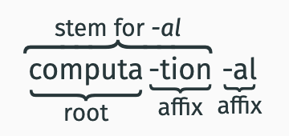

# morphological analysis

- [morphological analysis](#morphological-analysis)
    - [example of lexical entry](#example-of-lexical-entry)
  - [forming complex words](#forming-complex-words)
- [terminology](#terminology)
  - [roots and stems](#roots-and-stems)
- [morphological analysis - class on 10/30](#morphological-analysis---class-on-1030)
    - [reminders and examples](#reminders-and-examples)
    - [more terms](#more-terms)
  - [roots vs stem](#roots-vs-stem)
  - [able rule](#able-rule)
    - [Summary: Properties of the \[əbl̩\]-rule](#summary-properties-of-the-əbl̩-rule)
    - [summary of morthological rules](#summary-of-morthological-rules)
  - [prefix  and suffix](#prefix--and-suffix)
- [ambiguitiy](#ambiguitiy)
    - [exmaples](#exmaples)
  - [Morphological ambiguity](#morphological-ambiguity)
      - [crazy example](#crazy-example)
  - [Infixation](#infixation)
  - [Circumfixes](#circumfixes)
- [post midterm notes on morphological analysis](#post-midterm-notes-on-morphological-analysis)
    - [Right-Hand Head Rule: (final)](#right-hand-head-rule-final)
- [discussion notes](#discussion-notes)
  - [RHHR](#rhhr)
      - [HW NOTES/TIPS](#hw-notestips)

For each morpheme, a speaker has memorized:
1. Phonemic representation
2. Meaning
3. Part of speech (noun, verb, …)

Terminology: `Lexicon` - The mental lexicon stores idiosyncratic information about
morphemes in memory.

### example of lexical entry 
“Cat”:
- Phonemic representation: /kæt/
- Part of speech: noun
- Meaning:meower

## forming complex words
 -  As we have seen, it is possible to combine meaningful parts
into complex words.

 -  In many cases, these meaningful parts cannot stand on
their own.

[əbl̩] with new words
[ti̵ɹl] “to rip out by the roots”

  - becomes

[ti̵ɹləbl̩] “can be ripped out by the roots

meaning: Speakers do not just have all the words with [əbl̩]
memorized. Rather, there seems to be a rule that adds [əbl̩].

Languages have productive rules for
combining meaningful parts to form complex
morphological expressions.

# terminology 
reminder 
 a morpheme is a sequence of phonemes that carries a
meaning and does not itself consist of meaningful parts.

[ɹid] and [əbl̩] are both morphemes.

Terminology: `Free morpheme`
A free morpheme can stand on its own, i.e. as a free “word”.
- examples:  [ɹid], [kæt], [aɹdvaɹk]

Terminology: `Bound morpheme`
A bound morpheme cannot stand on its own.
- Examples: [əbl̩], [nɛs]

Terminology: `affix`
a bound morpheme that attaches to a stem

Terminology: `Stem`
unit to which affix can be attached

Terminology: `root`
stem that cannot be analyzed any further into
constituent morphemes.

## roots and stems

all roots are stems but not all stems are roots 

___ 

# morphological analysis - class on 10/30

### reminders and examples
A morpheme is a sequence of phonemes that carries a
meaning and doesn't consist of meaningful parts itself. 

Terminology: `Free morpheme`
A free morpheme can stand on its own, i.e. as a free “word”.

Examples: [ɹid], [kæt], [aɹdvaɹk]

Terminology: `Bound morpheme`
A bound morpheme cannot stand on its own.

Examples: [əbl̩], [nɛs]

### more terms
Terminology: `Affix`
An affix is a bound morpheme that attaches to a stem.

Terminology: `Stem`
A stem is a unit to which affixes can be attached.

Terminology: `Root`
A root is a stem that cannot be analyzed any further into
constituent morphemes.

## roots vs stem
root vs stem, sometime same thing but not allwsy,s diff is when more than one affix in a word

All roots are stems, but not all stems are roots.
stem for -al
⏞⏞⏞⏞⏞⏞⏞computa⏟
root)
-tion⏟
affix)
-al⏟
affix)

In this example, the root is also the stem for -tion

## able rule
Towards the [əbl̩]-rule

 -  [əbl̩] attaches to the end of stems. (We will see shortly that
such affixes are called suffixes.)

 -  [əbl̩] can attach to the end of verbs:
(1) [wɑʃ] + [əbl̩] = [wɑʃəbl̩]

 -  But [əbl̩] does not attach to adjectives:
(2) *[hæpi] + [əbl̩] = [hæpiəbl̩]

 -  [əbl̩] also does not attach to nouns:
(3) * [ɹʌɡ] + [əbl̩] = [ɹʌɡəbl̩]

When [əbl̩] attaches to a verb, it forms an adjective:

(4) a. [ɹidəbl̩]
b. [duəbl̩]
c. [l ͡aȷkəbl̩]

### Summary: Properties of the [əbl̩]-rule
1. It only combines with verbs, not nouns or adjectives.
2. It attaches to the right of the verb.
3. The result of attaching [əbl̩] is an adjective.
   
Verb + /əbl̩/ = Adjective

### summary of morthological rules 

1. Verb + /əbl̩/ = Adjective
2. Adjective + /nɛs/ = Noun
3. Adjective + /ən/ = Verb
4. Verb + /i̵ɹ/ = Noun
5. /ɹi/ + Verb = Verb
6. /ʌn/ + Adjective = Adjective
7. /ʌn/ + Verb = Verb
8. Verb + /mɛnt/= Noun
9. Noun + /lɛs/= Adjective
10. Noun + /fʊl/= Adjective
11. /dɪs/ + Verb = Verb
12. Noun + /z/ = Noun
13. Verb + /d/ = Verb

## prefix  and suffix
Terminology: `Prefix`
A prefix attaches to the front of the stem.

Terminology: `Suffix`
A suffix attaches to the end of the stem.

# ambiguitiy
If a sequence of sounds, morphemes, or words can have
more than one meaning, we say that this sequence is
ambiguous

two  types of ambiguity:
1. Lexical ambiguity:
two morphemes happen to sound the same
1. Structural ambiguity:
arrangements of elements differs

### exmaples 
 -  bank: edge of a river –or– a financial institution

 -  bat: an implement to hit a ball with –or– the animal

 -  [ɹɛd]: the color –or– the past tense of [ɹid]

 -  can: be able to –or– a cylindrical metal container

## Morphological ambiguity

Some words can be formed in more than one way, giving rise
to different meanings. This is a kind of structural ambiguity.

#### crazy example

 -  Establish:
“to set up, put in place, or institute”
 -  Dis-establish:
“to end the established status of a body, in particular a church”
 -  Disestablish-ment:
“the separation of church and state”
 -  Anti-disestablishment:
“opposition to disestablishment”
 -  antidisestablishment-ary:
“of or pertaining to opposition to disestablishment”
 -  Antidisestablishmentari-an:
“an opponent of disestablishment”
 -  Antidisestablishmentarian-ism:
“the movement or ideology that opposes disestablishment”

## Infixation

Terminology: `Infix`
An infix attaches inside the stem.

## Circumfixes
Terminology: `Circumfix`
A circumfix attaches to both the front and end of the stem.

Circumfixes are typologically rare.

if thing that looks like a prefix and like an affix cannot be separated

• English:
em-bold-en, en-light-en

# post midterm notes on morphological analysis

Affixation has :
Prefixation
Infixation
Suffixation
Circumfixation

various parts of speech can be compounded

Various parts of speech can be combined as compounds.
1. N + N = N ([dɑl] + [h͡aws])
2. N + V = V ([bi̵ɹd] + [wɑtʃ])
3. A + V = V ([dʌbl̩] + [bʊk])
4. A + N = N ([blæk] + [bɔɹd])
5. V + N = N ([sp͡ɔȷl] + [spɔɹt])
6. A + A = A ([blu] + [gɹin])

English suffixes:
- V + /i̵ɹ/ = N
- V + /mɛnt/ = N
- V + /əbl̩/ = A
- A + /nɛs/ = N
- A + /ən/ = V
- N + /lɛs/ = A
- N + /fʊl/ = A
- N + /z/ = N
- V + /d/ = V

English prefixes:
- /ɹi/ + V = V
- /ʌn/ + V = V
- /ʌn/ + A = A
- /dɪs/ + V = V

Pattern:
• Prefixes never change the category.
• Suffixes sometimes change the category.

Consequence:
Affixes have a category, just like free morphemes.
- [i̵ɹ] Noun “one who does X”
- [mɛnt] Noun “action/result of X”
- [əbl̩] Adjective “able to be Xed”
- [nɛs] Noun “state of being X”
- [ən] Verb “make/become X”

### Right-Hand Head Rule: (final)
In English, the head of a morphologically complex
expression is the right-most morpheme.

___
# discussion notes 
## RHHR 

right hand head rule?
part of speech of a word is based on 

carelessness
3 morephimes

care verb

less adj

ness is a noun

the head is the one on the right, and gives the part of speech

example,carelessness nes is a noun , less ness can't be combined, so its careless, (verb + adj = adj on right) + noun on right = noun

disapproved - dis + approve = verb 

disapprov + ed = verb
f

unrefillable

#### HW NOTES/TIPS

15 morphimes in q1

maŋu te? ?une - child walked

maŋu te? yomo - woman walked

pənta?m - men

man - pən

mother 

child - ?une

woman 

walk

come

plural - ta?m (men)

present

past 

like

far

