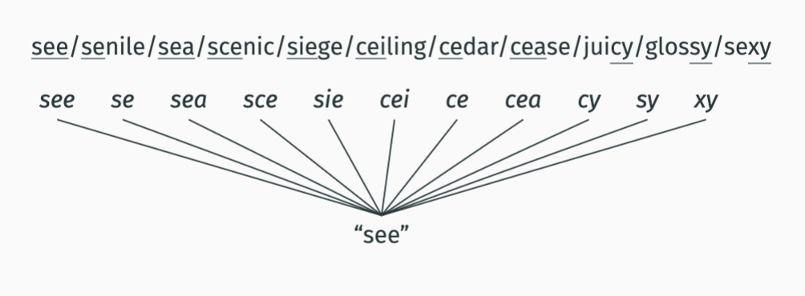
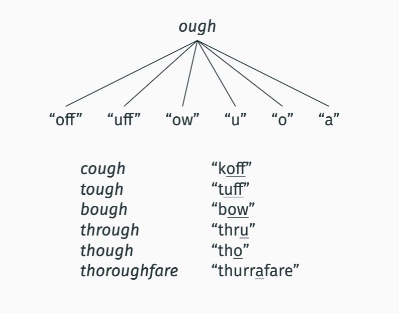
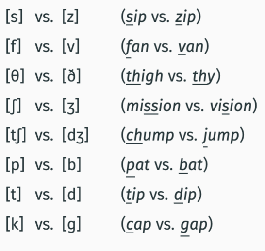
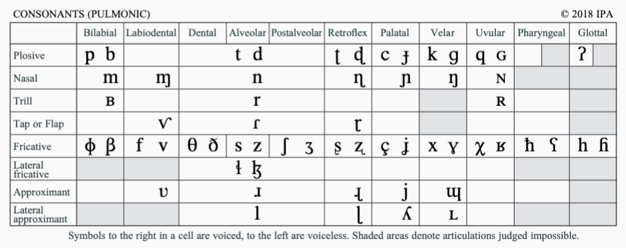
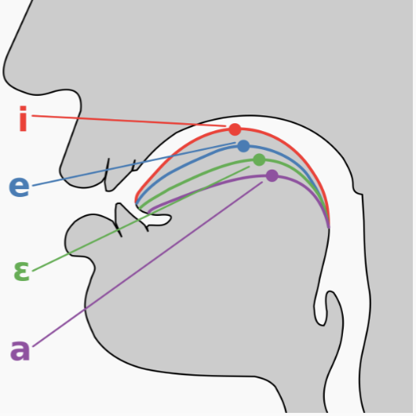
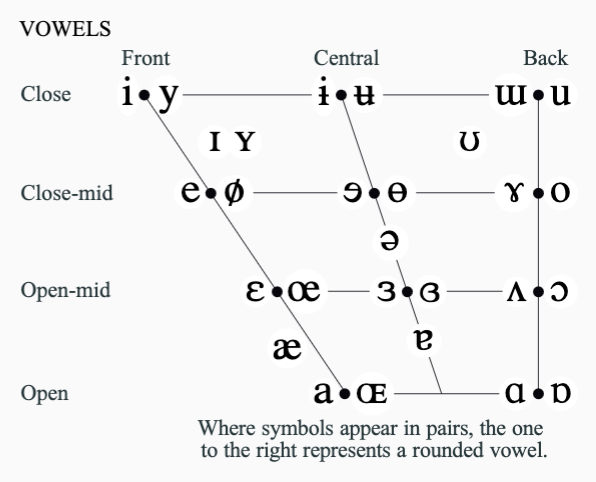

# lecture 2 week 1 notes

- [lecture 2 week 1 notes](#lecture-2-week-1-notes)
- [Vocal track anatomy](#vocal-track-anatomy)
    - [the tongue](#the-tongue)
    - [the larynx](#the-larynx)
    - [the glottis](#the-glottis)
    - [the velum](#the-velum)
    - [the hard Palate](#the-hard-palate)
    - [alveolar ridge](#alveolar-ridge)
    - [the postalveolar ridge](#the-postalveolar-ridge)
    - [the teeth](#the-teeth)
    - [the lips](#the-lips)
  - [problem w/ spelling](#problem-w-spelling)
    - [why not english?](#why-not-english)
  - [IPA](#ipa)
      - [new symbol?](#new-symbol)
- [consonants](#consonants)
  - [voicing](#voicing)
  - [nasality](#nasality)
      - [__nasal sounds__](#nasal-sounds)
    - [manner of articulation](#manner-of-articulation)
    - [stops](#stops)
      - [__bilabial stop examples__](#bilabial-stop-examples)
      - [__alveolar stop examples__](#alveolar-stop-examples)
      - [__velar stops__](#velar-stops)
      - [__glottal stops__](#glottal-stops)
  - [fricatives](#fricatives)
      - [__bilabial fricative examples__](#bilabial-fricative-examples)
      - [__labiodental fricative examples__](#labiodental-fricative-examples)
      - [__dental fricatives__](#dental-fricatives)
      - [__alveolar fricatives__](#alveolar-fricatives)
      - [__postavleolar fricatives__](#postavleolar-fricatives)
      - [__glottal fricative__](#glottal-fricative)
  - [affricates](#affricates)
      - [__english affricatives example__](#english-affricatives-example)
  - [approximants](#approximants)
      - [__labial approximant example__](#labial-approximant-example)
      - [__alveolar approximant example__](#alveolar-approximant-example)
      - [__palatal approximant example__](#palatal-approximant-example)
  - [the ipa](#the-ipa)
- [vowels](#vowels)
  - [vowel height](#vowel-height)
  - [vowel backness](#vowel-backness)
  - [lip rounding](#lip-rounding)
  - [tenseness](#tenseness)
  - [examples](#examples)
    - [front vowels examples](#front-vowels-examples)
    - [central vowels examples](#central-vowels-examples)
    - [back vowels examples](#back-vowels-examples)
  - [diphthongs](#diphthongs)
    - [front diphthong exapmles](#front-diphthong-exapmles)
    - [back diphthongs](#back-diphthongs)
  - [vowels in IPA](#vowels-in-ipa)
    - [exxamples](#exxamples)
    - [HW note](#hw-note)

# Vocal track anatomy

### the tongue

- the tip of the tongue is the tip

- the blade of the tounge is the front
- the blade of the tongue is the back

### the larynx 
- In the middle of your
throat is your larynx
- Inside your larynx are
muscles called the vocal
folds
- The opening between
the vocal folds is the
glottis

### the glottis 
- The vocal folds have the ability to open and close the
glottis.
- When the glottis is closed, air can’t leave the lungs.
-  When the glottis is open, air freely leaves the lungs.
- When the vocal folds come so close together that they are
almost closed, they vibrate. This vibration is my voice.

### the velum
is the soft part in the back of the mouth
- It is the doorway to the
nasal passage.
- If it is lowered, air can
go into the nasal cavity
and out the nose.
- If it is raised, air has to
go through your mouth.

### the hard Palate

hardest part of the mouth (roof area infront of velum)

### alveolar ridge
- The fleshy ridge just
behind the top teeth is
the alveolar ridge.

### the postalveolar ridge
-  area between your
palate and your alveolar
ridge is the postalveolar
(or alveo-palatal) region.
- The roof your mouth
rises sharply, big slope in mouth 

### the teeth

- help make sounds like th and f 

### the lips 

help make f m p sounds

## problem w/ spelling 

need an accurate way of representing any sounds in written form

### why not english?
- often ambiguous
  - there their they're
- same speling different sounds
  - read, bow, roof

- some sounds dont have a symbol and need multiple letters 

- other languages ahve sounds that aren't properly represented by english 

## IPA 

100 years old made by ipa

unambiguous
-  1 symbol per sound, 1 sound per symbol

universal
- all *known* human phones are represented

#### new symbol?
childrens sharp inhale when they cant say s(or she said x's?)

many symbols used in ipa are same as in our orthography, but this doesnt mean they are the same thing

if a symbol is from ipa it is in square brackets []

when speech is in ipa we say its `forming a phonetic transcription`

# consonants 
speech sounds assosiated with partial or complete closure of the vocal tract

- manner of articualtation 
  -  how the gesture in VT occurs

- place of articulation
  - where the gesture occurs in vt
- nasiality
  - if velum is lowered, allowing vibrating air in nasial cavity
- voicing
  - if the vocal folds are **vibrating**

## voicing
whetehr or not the vocal folds are vibrating while sounds are being made

- voiced
    - vocal folds vibrate while sound is being made 
- voiceless
  - dont vibrate while sounding

lots of consonants differ in voicing 
(sip zip, fan van, chump jump, etc)

## nasality
if the velum (soft tissue in the back) is lowered or raised

- if lowered, classified as nasal
- if raised its oral

#### __nasal sounds__

[n] (ba**n**)

[m] (ba**m**) 

[ŋ] (ba**ng**)

### manner of articulation

how the gesure in VT occurs 
1. stops
2. fricatives
3. approximants

### stops 
sounds that create a complete clockade in the oral tract

they call stops plosives in the IPA

#### __bilabial stop examples__ 

w the lips 

- [p] bilabial, voiceless, oral “**p**an” | so you cant really make a long P and stuff because at some point it all just goes out at once

- [b] bilabial, voiced, oral “**b**an” | same with B 

- [m] bilabial, voiced, nasal “**m**an” 

#### __alveolar stop examples__ 

[- t] alveolar, voiceless, oral “**t**an”

- [d] alveolar, voiced, oral “**D**an”

- [n] alveolar, voiced, nasal “**D**an”

- [ɾ] alveolar, voiced, oral, flap “le**tt**er”

- [r] alveolar, voiced, oral, trill “pe**rr**o” (in Spanish

#### __velar stops__

- [k] velar, voiceless, oral “**c**an”

- [ɡ] velar, voiced, oral “**g**et”

- ŋ] velar, voiced, nasal “si**ng**”

#### __glottal stops__
- [ʔ] glottal, voiceless, oral uh- oh, Hawai'i

## fricatives

produced by creating a radical narrowing in the oral tracts

through that radical narrow, a turbulance in the air flow is created that makes the characteristic hissing sound

#### __bilabial fricative examples__

- [ɸ] bilabial, voiceless, oral “**F**uji” (in 
Japanese)

- [β] bilabial, voiced, oral “de**b**er” (in Spanish)

#### __labiodental fricative examples__

- [f] labiodental, voiceless, oral “**f**an”

- [v] labiodental, voiced, oral “**v**an”

theres no labiodental stops bc teeth have gaps

#### __dental fricatives__

- [θ] dental, voiceless, oral “**th**igh”
- [ð] dental, voiced, oral “**th**e”

#### __alveolar fricatives__
- [s] alveolar, voiceless, oral “**s**ip”
- [z] alveolar, voiced, oral “**z**ip”

#### __postavleolar fricatives__

- [ʃ] postalveolar, voiceless, oral “mi**ss**ion”
- [ʒ] postalveolar, voiced, oral “vi**s**ion”

#### __glottal fricative__
- [h] glottal, voiceless, oral “**h**eap”

## affricates

produced as a stop that is released into a fricative

sometimes treated as a single sound, we'll treat them as the combo of 2 sounds 

#### __english affricatives example__
- [tʃ] alveopalatal, voiceless, oral “**ch**ump”
- [dʒ] alveopalatal, voiced, oral “**j**ump”

## approximants 
Approximants involve a less radical narrowing in the oral tract
than is found with fricatives, but greater than is found with
vowels.

For this reason, approximants are sometimes also called
semi-vowels.

#### __labial approximant example__
- [w] labio-velar, voiced, oral “**w**in”

#### __alveolar approximant example__
- [l] alveolar, voiced, oral, lateral “**l**ed”
- [ɹ] alveolar, voiced, oral “**r**ed”

upside down r is the alveolar approximant like in red, the rightside up r is the alveolar stop voiced oral trill like in perro

an L is a latteral sign and when you drop either both sides or just one side of tongue the air goes around the sides

#### __palatal approximant example__

- [j] palatal, voiced, oral “**y**es”
  - look into if its the same as the y/j sound in west slavic names like jokic

## the ipa 

in the ipa they call stops `plosives`

# vowels
speech sound that is articualted while the vocal tract is completely open

no air pressure build up at any point above the glottis

__params for describing vowels__

1. Tongue position:
– Height
– Backness
2. Rounding of lips:
rounded vs. unrounded
3. Tenseness:
tense vs. lax

## vowel height 

heigh of the tongues higest point in the mouth
 -> distance between tongue and roof of the mouth

 “h**ea**t” (high) vs. “h**a**t” (low)

## vowel backness
how far back in the mouth is the tongue positions

“h**ea**t” (front) vs. “h**oo**t” (back)

## lip rounding 
Are the lips rounded while the vowel is produced?

“h**oo**t” (rounded) vs. “h**ea**t” (unrounded)

## tenseness
tense vowels:
- produced with greater muscle tension 
- longer
lax vowels:
- lesstension 
- shorter

## examples 
### front vowels examples

- [i] high, unrounded, tense “b**ee**t”
- [ɪ] high, unrounded, lax “b**i**t”
- [e] mid, unrounded, tense “d**e**ber” (in Spanish)
- [ɛ] mid, unrounded, lax “r**e**d”
- [æ] low, unrounded, lax “r**a**d”
- [a] low, unrounded, tense “c**a**r” (in Boston English

### central vowels examples

- [i̵] high, unrounded, lax “ros**e**s”
  - eh sound?
- [ə] mid, unrounded, lax “Ros**a**’s”
  - uh sound?

### back vowels examples

- [u] high, rounded, tense “f**ood**”
- [ʊ] high, rounded, lax “p**u**t”
- [o] mid, rounded, tense “perr**o**” (in Spanish)
- [ɔ] mid, rounded, lax “**o**range”
  - th**ough**t is another one
- [ʌ] mid, unrounded, lax “c**u**t”
  - uh sound
- [ɑ] low, unrounded, tense “c**o**t”

## diphthongs

all previous vowels have been pure
  - no noticible change in quality of vowel throughout the production
  
diphthongs are another group where they end differently than how they start

basically a combo of two vowels 

### front diphthong exapmles 
- [e͜j] mid, front, unrounded “b**ai**t”
- [a͜j] low, front, unrounded “**i**ce”
- [a͜w] low, front, rounded “bl**ou**se”

### back diphthongs 

- [o͜w] mid, back, rounded “b**oa**t”
- [ɔ͜j] mid, back, rounded “b**oy**”

## vowels in IPA

### exxamples 
[fʌnɑlədʒɪsts mʌst kip ðe͜jɹ ʔiɹz spɛktækjuli̵ɹli klin]
Phonologists must keep their ears spectaualrly clean

### HW note

on hw write down what is on the soundfile, not what we would say

