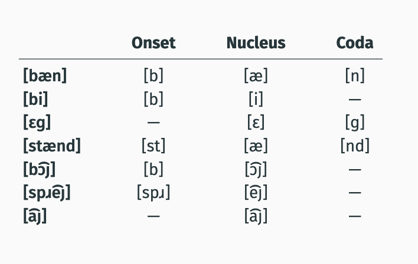
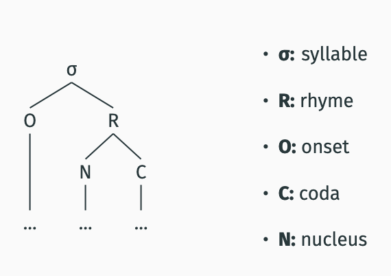
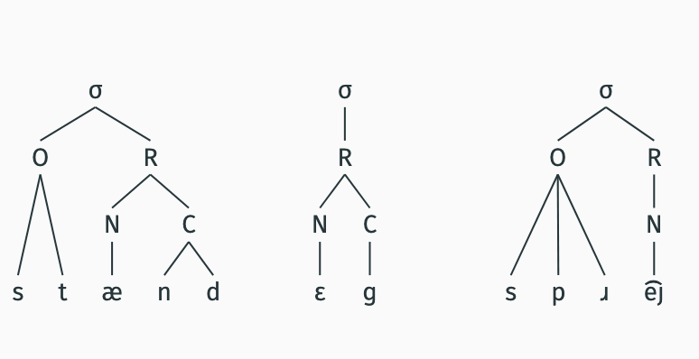
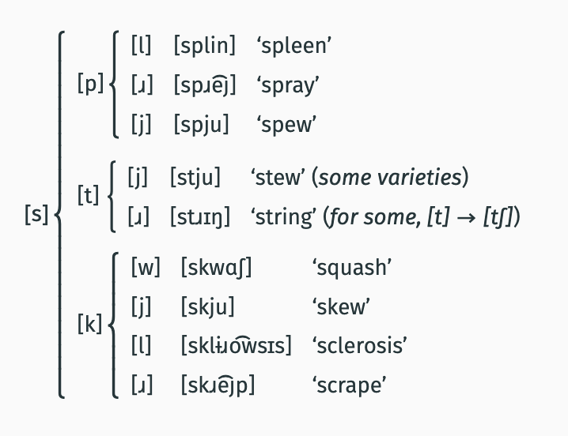

- [week 1 lecture 3 notes](#week-1-lecture-3-notes)
- [syllables](#syllables)
  - [syllables are fixed](#syllables-are-fixed)
  - [syllables are rule governed](#syllables-are-rule-governed)
      - [example](#example)
      - [conclusion](#conclusion)
  - [structure of syllables](#structure-of-syllables)
    - [structure](#structure)
    - [examples](#examples)
  - [rhymes](#rhymes)
  - [syllabification trees](#syllabification-trees)
  - [building syllables](#building-syllables)
    - [phonotactics](#phonotactics)
    - [most complex onsets](#most-complex-onsets)
  - [Phonotactics and syllabification](#phonotactics-and-syllabification)
  - [syllabification algorithm](#syllabification-algorithm)

# week 1 lecture 3 notes

# syllables
- when we say words like `understanding` we dont just pronounce them as a simple string of sounds
- the sounds are in syllables
- sulable boundaries are in the ipa with a period [.]

– [ʌndi̵ɹstændɪŋ] vs – [ʌn.di̵ɹ.stæn.dɪŋ] vs [ʌ.ndi̵ɹs.tænd.ɪŋ]

– [ɹɛkɹi ͡eȷʃən] vs – [ɹɛ.kɹi. ͡eȷ.ʃən]

– [bʌl ͡ owni] vs – [bʌ.l ͡ ow.ni]

## syllables are fixed
native speakers of a language have clear intuitions about where syllable breaks can and cannot occur

a. [ʌn.di̵ɹ.stæn.dɪŋ]
b. *[ʌ.ndi̵ɹs.tænd.ɪŋ]͡

a. [ɹɛ.kɹi.͡eȷ.ʃən]
b. *[ɹɛk.ɹi.͡eȷʃ.ən]͡

a. [bʌ.l͡ow.ni]
b. *[bʌl.͡own.i]

## syllables are rule governed

q: Is it possible that speakers have simply memorized the syllable breaks for all the words of a language?

a: No! Speakers have intuitions about breaks in words they've never seen before or even made up words

#### example 
[b͡owlɡəstænd]

is [b͡owl.ɡe.stænd]

#### conclusion

The placement of syllables is not memorized, but instead is the result of a regular process, i.e. a `rule`.

**refresher**
when you know a language you know

1. a finite set of basic elements
-  what sounds does a word consist of?

2. a set of rules for combining basic elements like grammar
- how are soounds arranged into syllables
  

## structure of syllables

what is the mechanism that groups sounds into syllables?

  To answer this question, we will need to learn a bit about the
structure of syllables and the phonotactics of English.

### structure
each syllable has 3 basic parts 

Terminology: `Onset`
- consonant(s) at the front of the syllable

Terminology: `Nucleus`
- the sound (typically, a vowel) in the middle of the syllable

Terminology: `Coda`
- Consonant(s) at the end of a syllable

Not all of these parts are present in all syllables:
- some have no onset [it]
- some have no coda [ti]
- every syllable ***does*** have a nucleus 

### examples 

## rhymes 
the nucleus and coda group togetehr to the exe of the onset bc the syllables that have the same nucleus and ocda stand in a special relationship to eachother: they `rhyme`

[spɪt], [sɪt], and [kɪt] all rhyme.

[sɪt], [sɪts], [sɪn], and [sɪp] do not rhyme.

so Terminology: `Rhyme`
- the nucleus and coda together can form one at times

## syllabification trees 

 when drawing these she recommends going from the bottom up

 

 ## building syllables
 how do we decide which sounds become onsets, nuclei, and codas

 to answer this we learn about `phonotactice constraints`
 
 ### phonotactics 
 only one of these can be an english word

 a. [pfluk] maybe

b. [tloʔ.tli] no 

c. [tsɑ] no/maybe

d. [tæg.nɪsp] yes ig

e. [nuktʃ] no 

Terminology: `Phonotactics`
- rules that determine possible onsets and codas are called phonotactic constraints (or phonotactics)
  - [pfl] is not a possible onset in English.
  - [tl] is not a possible onset in English.
  - [ts] is not a possible onset in English.
  - [ktʃ] is not a possible coda in English.

Different languages have different phonotactic constraints:

German (Germanic):
[pfluk] ‘plow’

Nahuatl (Uto-Aztecan; Mexico):
[tloʔ.tli] ‘hawk’

Tlingit (Na-Dene; Alaska):
1. [tsɑ] ‘seal’
2. [nuktʃ] ‘to do’

### most complex onsets 

## Phonotactics and syllabification

[ʌn.di̵ɹ.stæn.dɪŋ] vs. *[ʌ.ndi̵ɹs.tænd.ɪŋ]

Phonotactic constraints guide how a word is syllabified:
- [nd] is not a possible onset in English.
  
How to tell whether a sequence of sounds is a possible onset or coda?
- A string is a legal `onset` if it can begin a word
- A string is a legal `coda` if it can end a word
- Try:
pl bz bd
slk sts lk
h ŋ θ
ɹb pt sk

## syllabification algorithm

1. all vowels become `nuclei` . (NB: Diphthong → one nucleus)
2. for each nuclus find hte **largest** continous sequence immendiatley preceding the nuclues and allowed by the languages phonotactics to be an onset, make it an onset
   b͡owlɡəstænd - b(o) ow(n) l(c) g(o) e(n) st(o) ae(n) nl(c)
3.  For each nucleus, find the largest continuous sequence
(i) immediately following the nucleus, (ii) not part of an onset,
and (iii) allowed by the language’s phonotactics to be a coda;
make it a coda.
4. For each nucleus, make a rhyme out of the nucleus and, if
there is one, the immediately following coda.
5. For each rhyme, make a syllable out of the rhyme and, if there
is one, the immediately preceding onset.